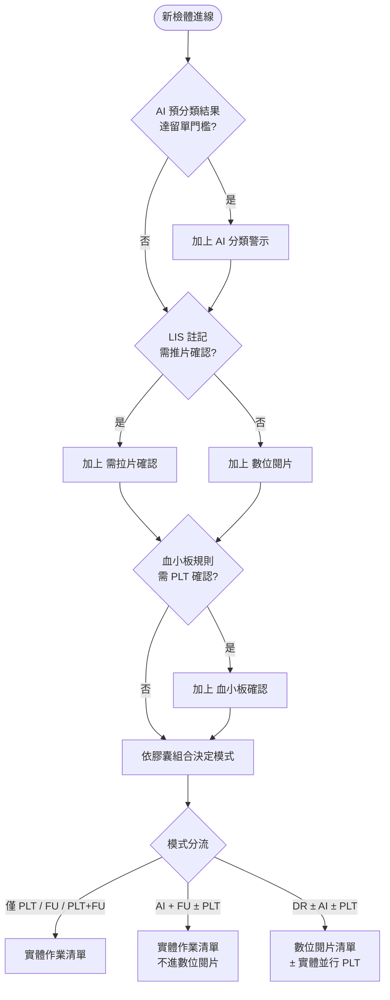
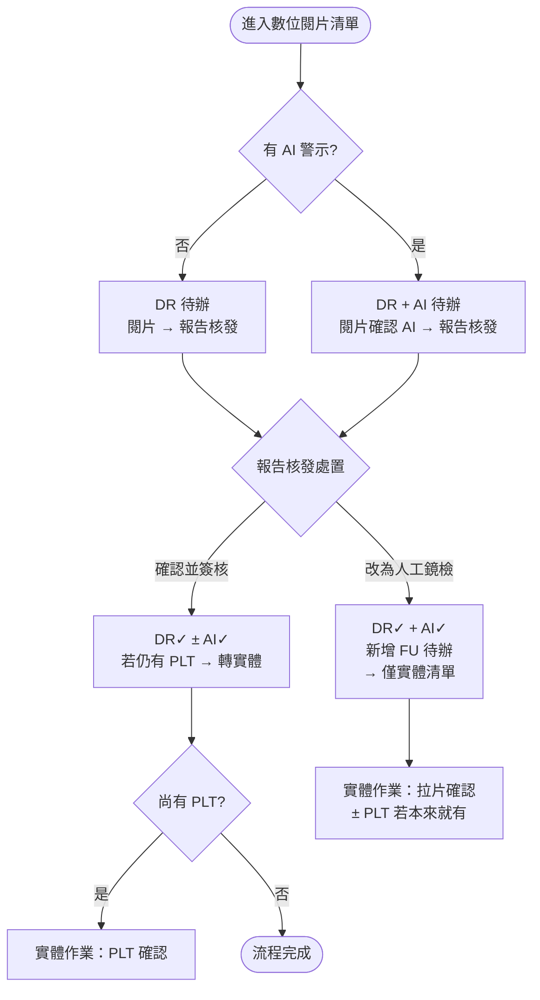
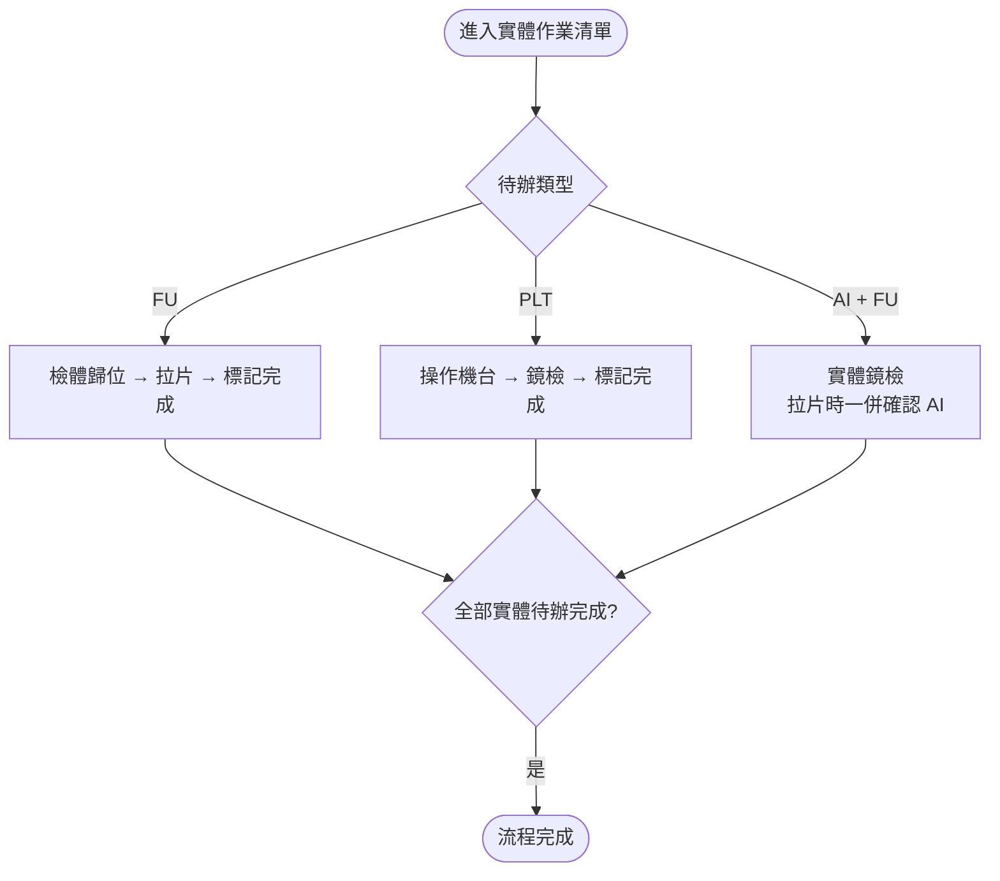

# 狀態膠囊與作業模式 — 流程架構

> 林口長庚血球型態分類軟體 Demo（v2-優化架構版）  
> 說明檢體進線時如何決定四種膠囊、以及檢體管理「數位閱片／實體作業」模式如何分流。

---

## 一、評估結論：為何此流程較合理

先前僅以「16 種膠囊組合是否合法」描述，缺少**進線時誰決定掛哪顆膠囊**。您提出的流程補上三個獨立判斷來源，與實務較一致：

| 判斷來源 | 膠囊 | 說明 |
|----------|------|------|
| AI 預分類 × 留單門檻 | **AI 分類警示** | 系統比對 `LEAVE_THRESHOLDS` 後自動標記 |
| LIS「需推片確認」 | **需拉片確認** 或 **數位閱片** | **互斥**：有推片註記 → FU；無 → DR |
| 血小板規則 | **血小板確認** | 可與上述並存（實體作業） |

**核心改進**：`需拉片確認` 與 `數位閱片` 由 **LIS 是否需推片** 決定，不會同時作為「初始待辦」並存；因此自然解釋：

- 為何 **AI + FU** 沒有 DR（LIS 要推片 → 走實體，AI 僅能實體確認）
- 為何 **AI 一定伴隨 DR**（在數位路徑上：無推片註記才掛 DR，有 AI 則 DR+AI）
- 為何 **改為人工鏡檢** 後才出現 DR✓ + FU 待辦（數位做完後，臨床決定改走推片）

Demo 目前將結果**直接寫在** `database.js`；正式環境應由後端依下列規則在進線時寫入 `status[]`。

---

## 二、進線決策流程（總圖）



---

## 三、進線三步驟（詳細）

### 步驟 1：AI 分類警示（獨立、可選）

```
IF AI 預分類 metrics 任一項達留單門檻（LEAVE_THRESHOLDS）
THEN status += "AI Alert"
```

- 與 LIS 推片註記**無關**，先標記。
- 橘色膠囊；數位路徑上須與 DR 併存才進數位清單（見步驟 3）。

### 步驟 2：LIS 推片 vs 數位閱片（互斥）

```
IF LIS 有「需推片確認」註記
THEN status += "Follow-up"     // 需拉片確認
ELSE status += "Digital Review"  // 數位閱片
```

| LIS 推片 | 掛上膠囊 | 主要路徑 |
|----------|----------|----------|
| 有 | Follow-up | 實體作業 |
| 無 | Digital Review | 數位閱片（可並行 PLT） |

**不可**在進線時同時掛上待辦的 FU 與 DR。

### 步驟 3：血小板確認（可選、可並行）

```
IF 血小板數值 / 規則需人工鏡檢確認
THEN status += "PLT Check"
```

- 可與 DR 路徑或 FU 路徑並存。
- 實體作業模式處理；與數位閱片可**同時呈現**於同一檢體列。

---

## 四、模式分流規則

套用三步驟後，依**待辦中**膠囊決定檢體管理預設出現在哪個模式：

| 進線後膠囊（待辦） | 數位閱片模式 | 實體作業模式 | 說明 |
|-------------------|:------------:|:------------:|------|
| DR | ✓ | ✗ | 純數位 |
| DR + AI | ✓ | ✗ | 數位＋AI 確認 |
| DR + PLT | ✓ | ✓ | 數位＋實體 PLT |
| DR + AI + PLT | ✓ | ✓ | 常見複合待辦 |
| FU | ✗ | ✓ | 純實體拉片 |
| PLT | ✗ | ✓ | 純實體 PLT |
| PLT + FU | ✗ | ✓ | 實體雙待辦 |
| **AI + FU**（± PLT） | **✗** | **✓** | LIS 要推片 → 無 DR；AI 僅實體確認 |
| （無四者） | ✗ | ✗ | 一般／已完成 |

**程式對應**（`common.js`）：

- 數位清單排除 `AI + Follow-up` 雙旗標 → `isAiAlertAndFollowUpSpecimen()`
- AI 進數位清單須有 DR 膠囊 → `matchesAiAlertForDigitalList()`
- 數位已結、僅剩 PLT／FU → `shouldExcludeFromDigitalSpecimenList()`

---

## 五、數位閱片子流程



### 改為人工鏡檢（過渡狀態，非進線初始）

僅適用於**原在數位路徑**（曾有 DR）之檢體：

```
使用者於報告核發點「改為人工鏡檢」
→ workflow: digitalReview ✓, aiAlertConfirmed ✓（若有 AI）
→ status += Follow-up（待辦）
→ 自數位閱片待辦清單移除，改由實體作業處理拉片
```

此時可見：**DR 膠囊（已完成）+ FU 膠囊（待辦）** — 非進線時同時掛兩者待辦。

---

## 六、實體作業子流程



---

## 七、16 種組合對照（進線視角）

| # | 膠囊 | 能否進線出現 | 成因摘要 |
|---|------|:------------:|----------|
| 1 | （無） | ○ | 無觸發條件 |
| 2 | DR | ○ | LIS 無推片、無 AI、無 PLT |
| 3 | AI | **✗** | AI 單獨不掛；必與 DR 或 FU 連動 |
| 4 | PLT | ○ | 僅 PLT 規則 |
| 5 | FU | ○ | LIS 有推片、無 AI |
| 6 | DR+AI | ○ | LIS 無推片 + AI 達標 |
| 7 | DR+PLT | ○ | LIS 無推片 + PLT |
| 8 | DR+FU | **✗** 初始 | 僅「改人工鏡檢」過渡 |
| 9 | AI+PLT | **✗** | 無 DR 之 AI 不單獨存在 |
| 10 | AI+FU | ○ | LIS 有推片 + AI 達標 |
| 11 | PLT+FU | ○ | LIS 有推片 + PLT |
| 12 | DR+AI+PLT | ○ | LIS 無推片 + AI + PLT |
| 13 | DR+AI+FU | **✗** 初始 | 過渡態 |
| 14 | DR+PLT+FU | **✗** | LIS 推片與 DR 互斥 |
| 15 | AI+PLT+FU | **✗** | 等同 AI+FU（PLT 可併 AI+FU） |
| 16 | 四者全有 | **✗** 初始 | 過渡態 |

---

## 八、Demo 劇本範例對照

| 檢體 | 進線邏輯（敘述） | 膠囊 |
|------|------------------|------|
| H5080721201 | LIS 需推片 + AI Blast 達標 | AI + FU |
| H5080706286 | LIS 無推片 + AI Blast 2% | DR + AI |
| H5080720647 | LIS 無推片 + AI 6% + PLT 偏低 | DR + AI + PLT |
| H5080720847 | LIS 無推片 + PLT 規則 | DR + PLT |
| H5080706280 | LIS 需推片、無 AI | FU |
| H5080721101 | LIS 無推片、無 AI、無 PLT | DR |

---

## 九、與程式碼對應

| 概念 | 檔案 |
|------|------|
| 留單門檻 | `common.js` → `LEAVE_THRESHOLDS` |
| 模式預設篩選 | `MODE_DEFAULT_STATUS` |
| 數位／實體清單排除 | `shouldExcludeFromDigitalSpecimenList`, `isAiAlertAndFollowUpSpecimen` |
| 改人工鏡檢過渡 | `buildWorkflowDoneAfterManualFollowUpFromReport`, `addFollowUpForManualReviewFromReport` |
| 劇本資料 | `assets/data/database.js` |
| 成效調查情境 | `assets/data/scenario-specimens.js` |

---

## 十、正式上線建議（後端）

進線 API 建議順序實作：

1. `POST /specimens/ingest` 接收 LIS + AI 結果  
2. `evaluateLeaveThresholds(aiMetrics)` → `aiAlert: boolean`  
3. `lis.requiresSmearConfirmation` → `followUp: boolean`（`true` 則**不**設 `digitalReview`）  
4. `evaluatePltRule(plt, ...)` → `pltCheck: boolean`  
5. 組裝 `status[]` 寫入資料庫  
6. 前端檢體管理僅讀取 `status` + `workflowDone`，不再硬編劇本

---

*本文件與 `common.js` 內「四種膠囊初始狀態規則」註解同步；若規則變更請兩處一併更新。*
